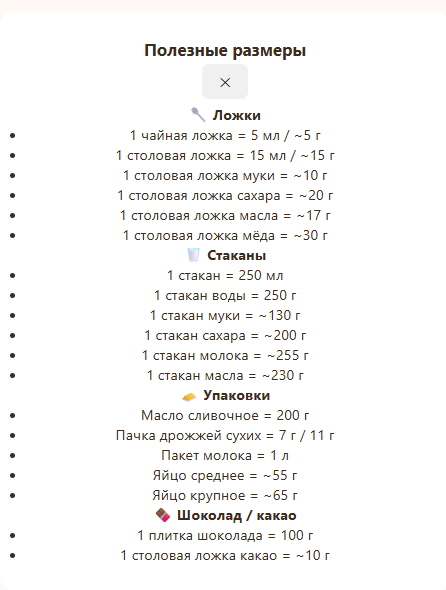
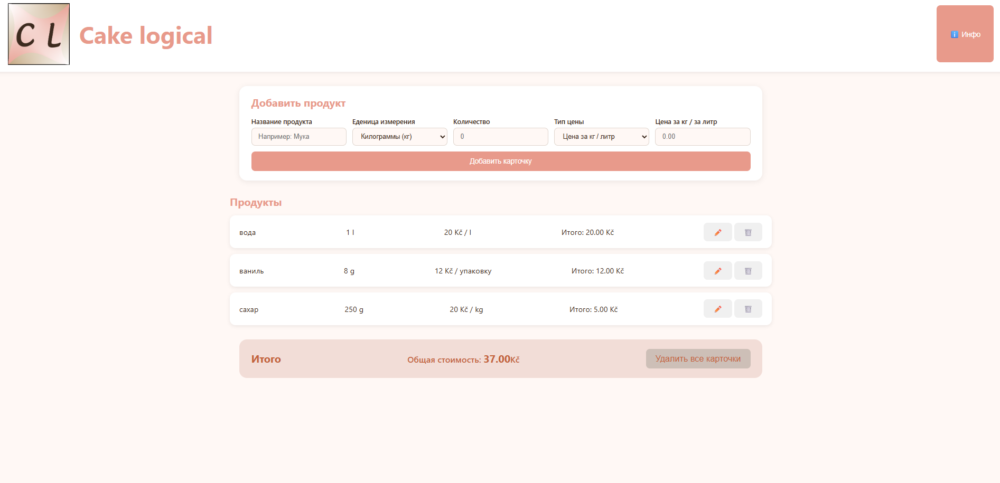

<div align="center">

# Hey, I'm Andrii! 👋🔥

[](https://git.io/typing-svg)

</div>

---

## 🧑‍💻 About Me

> 🎓 IT student focused on **Web Developer | Building Desktop Apps with Electron**  
> ⚡ Actively learning and using **HTML, CSS, JavaScript & Flask**  
> 🤝 Looking for friends to collaborate on projects together!  
> 📸 Sharing IT knowledge bits on **Instagram**

---

## 🚀 Featured Project

### 🍰 Cake Logical

> Desktop app for a cake-making client to track ingredient costs and pricing.

- Built with **Electron + HTML/CSS/JS**, packaged as a Windows `.exe` installer
- Local data persistence via **localStorage** — works fully offline
- Warm, pastry-themed UI designed around the client's brand
- 🔒 Private client repo — happy to share a demo/screenshots on request

<p align="center">
  
</p>
<p align="center">
  
</p>

---

## 🛠️ My Tech Stack

| 💡 Technology                  | 📊 Level                            |
| ------------------------------ | ----------------------------------- |
| 🌐 **HTML & CSS**              | ███████████░ Actively using         |
| 🐍 **Python + Flask**          | ████████░░░ Actively learning       |
| 🖥️ **Electron (Desktop Apps)** | ██████░░░░░░ Built my first release |
| ⚡ **JavaScript**              | ██████░░░░░░ Actively Learning      |
| 🐧 **Linux Ubuntu**            | █████░░░░░░ Learning                |

---

## 🧊 On Hold

> Paused for now while I focus on core web development fundamentals — planning to come back to it.

- ⚡ **React** — built basic components/hooks, comfortable with JSX, paused mid-learning

---

## 📊 My Skills

**Languages**


**Frameworks & Tools**


**Platforms**


---

## 🚀 Currently Working On

```python
class Andrii:
    def __init__(self):
        self.name = "Andrii"
        self.role = "IT Student"
        self.skills = ["HTML/CSS", "JavaScript", "Python", "Flask"]
        self.learning = ["Flask", "JavaScript", "Linux"]
        self.goal = "Build cool projects with cool people 🚀"
 
    def say_hi(self):
        print("Thanks for visiting my profile! Let's build something together 💪")
 
me = Andrii()
me.say_hi()
```

---

## 📫 Let's Connect!

<div align="center">

[](https://instagram.com/found.404f)
[](https://github.com/Andriiprog08)
[](https://youtube.com/@found.404f)

> 💬 _Interested in working on projects together? Message me on Instagram — I'd love to meet new people!_

</div>

---

<div align="center">

_⭐ If you like what I do, consider starring my repos!_

</div>
